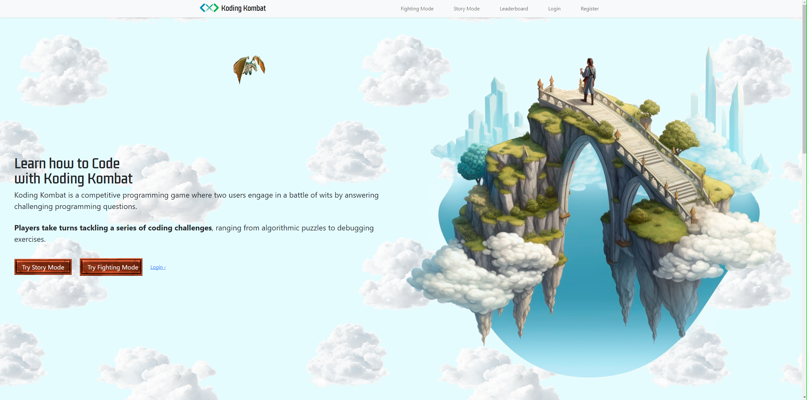
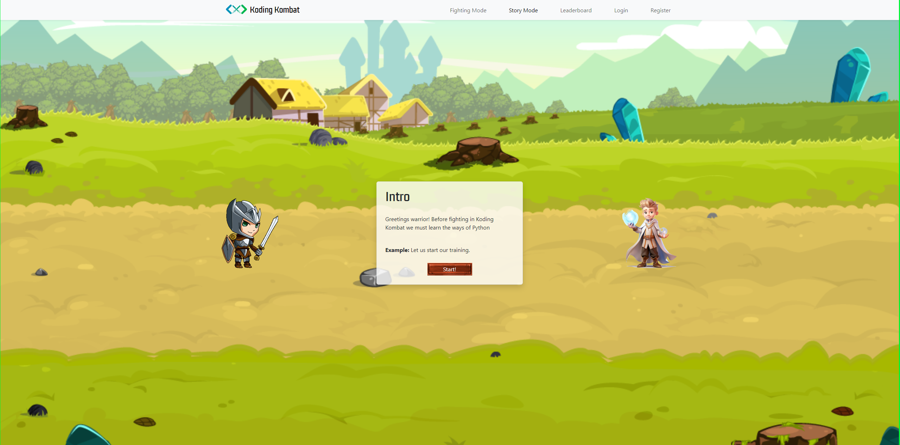
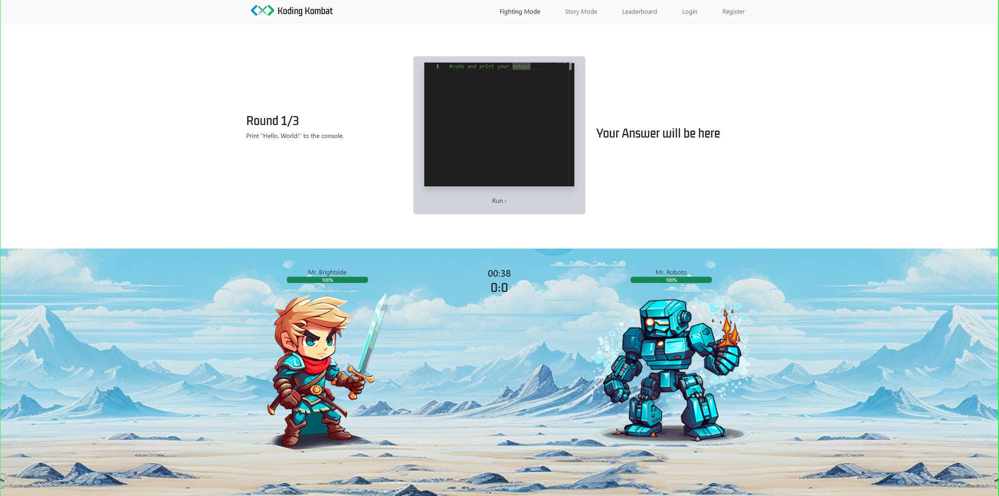
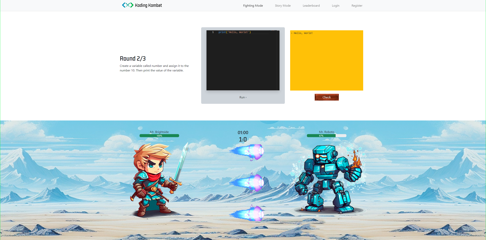
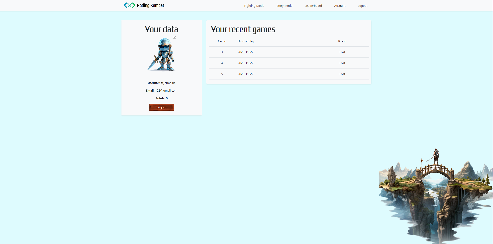
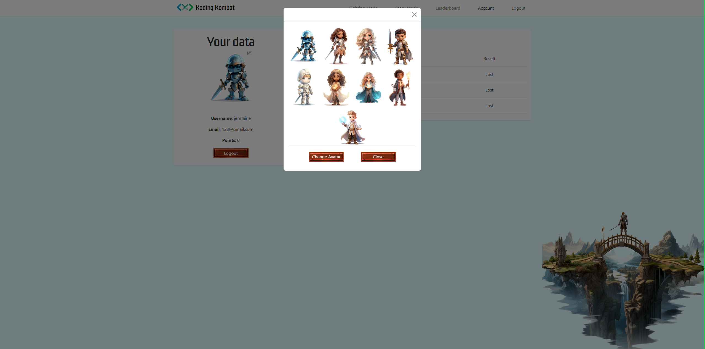

# Koding Kombat

[](LICENSE)
[](CONTRIBUTING.md)

Koding Kombat is an engaging educational coding platform tailored for adolescents, providing a fun and interactive way to learn coding skills, with a focus on Python. The platform incorporates gamified elements, featuring street-fighter-style beat 'em up combat animations in a unique medieval-themed setting with futuristic elements, including an AI-controlled robot opponent.

## Features

### Quest Mode

Embark on an adventurous coding journey designed for complete beginners. Quest Mode guides users through an interactive story, teaching Python programming basics along the way. Defeat enemies by correctly answering coding challenges, unlocking cool animations upon success.

### Fighting Mode

Challenge yourself in this competitive mode where you combat an AI-controlled opponent in timed challenges. Answer questions correctly to unleash devastating attacks on your opponent, reducing their health points. The winner is the first to reduce their opponent's health to zero by answering more questions correctly.

- **Leaderboard:** Accumulate points and showcase your prowess on the leaderboard.
- **Profile History:** View your previous game history in the Fighting Mode.

### Avatar Customization

Upon signup, personalize your avatar for an enhanced and unique experience. Your chosen avatar will be featured in both the story and fighting modes.

## Installation and Usage

1. Clone the GitHub repository:
   ```bash
   git clone https://github.com/jabz80/jabbascript
   ```
2. Navigate to the home directory::
   ```bash
   cd jabbascript
   ```
3. Install dependencies for the server:
   ```bash
   cd server
   npm install
   ```
4. Install dependencies for the client:
   ```bash
   cd ../client
   npm install
   ```
5. Run the frontend and backend servers:

   ```bash
   # In the server folder
   npm run dev

   # In the client folder
   npm run dev
   ```

6. Create an instance of a PostgreSQL hosting platform (e.g., Elephant SQL) and add the relevant DB_URL to a .env file in the server folder. Define a localhost PORT environment variable.run dev

7. Initialize the database tables:

   ```bash
   npm run setup-db

   ```

## Technologies Used

- HTML
- CSS
- Bootstrap 5
- React
- Express
- Vite
- Jest
- Supertest
- Nodemon
- Socket.io
- Bcrypt
- Axios
- Monaco-Editor
- React Router
- Vitest
- React Testing Library

## Screenshots

### Homepage


_Description: This is the landing page of Koding Kombat, where users can explore various features and navigate to different sections of the platform._

### Story Mode


_Description: In the Story Mode, users embark on an adventurous coding journey, facing coding challenges to progress through the interactive storyline._

### Fighting Mode


_Description: Experience the Fighting Mode, a competitive challenge where users combat an AI-controlled opponent by answering coding questions._


_Description: Another view of the Fighting Mode, showing the intensity of the coding challenges and the interactive combat animations._

### Profile


_Description: View your profile page, showcasing your accumulated points, leaderboard position, and your avatar chosen during signup._


_Description: Another perspective of the user profile, displaying additional details such as game history in the Fighting Mode._

Discover the joy of coding with Koding Kombat, where learning meets gaming! ⚔️🛡️👑🚀
